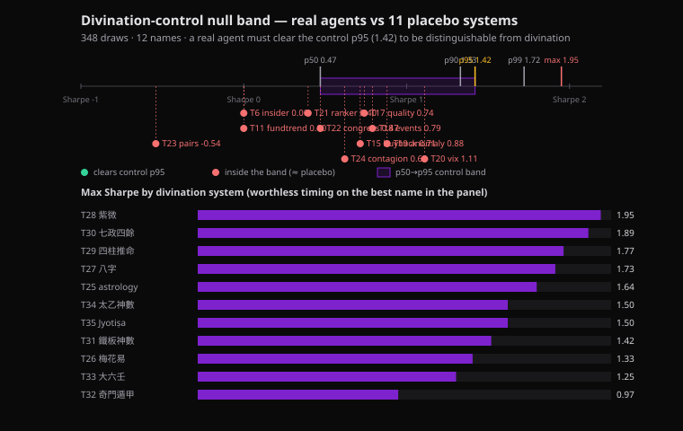

# Benchmark One-Pager — how we measure whether an agent is *real*

> **Thesis.** Every AI-investing product shows a backtest. We are the only one that ships the
> instrument to tell you whether that backtest is *skill* or *NVDA-flavoured luck*. We benchmark on
> three layers — **reliability, performance, and statistical significance** — and we publish the
> humbling number, not just the flattering one.

*Suite: 24 signal agents + 11 placebo controls. Panel for the significance work: 12 large-cap US
names (AAPL MSFT NVDA AMZN GOOGL META JPM XOM KO PG WMT JNJ), trailing 3y to 2026-06 (~753 bars),
10 bps costs, strictly lookahead-free.*

---

## Layer ② — Reliability (does the agent behave?)

Per-agent eval sets with categorised cases and hard pass/fail gates. This is the regression test
that an investor's diligence team actually cares about: it proves the agent does what it claims,
repeatably, at a known cost.

| Metric | Value |
|---|---|
| Agents with committed eval sets | **16** |
| Total eval cases | **91** |
| Pass rate | **97% (88/91)** |
| Cost per decision (p50) | **~$0.0008** |
| Latency (p50) | **6.5 s** |

*Each case records `entry_signal`, `total_return`, `Sharpe`, `exposure`, `n_trades`, and
`alpha_vs_market` — so a failing run tells you **which invariant broke**, not just "it went down".*

---

## Performance contract (what the backtest is allowed to claim)

Every backtest is **dual-benchmarked** and built to be un-foolable:

- **vs Buy-and-Hold** *and* **vs S&P 500 (SPY)** — so beta is never mistaken for alpha.
- **Lookahead-free invariants**: signal at close *i* → trade at open *i+1*; filing/publish-date keyed;
  **selection ≠ execution** (the LLM may only pick from a constrained strategy DSL, it cannot open
  arbitrary positions).
- **Costs included**: 10 bps per trade.

---

## Layer ③ — Significance (is the edge real, or the best of N coin-flips?)

**This is the layer almost no one else has.** We run 11 deliberately worthless divination systems
(紫微斗數, 八字, 七政四餘, Jyotiṣa, …) through the *identical* lookahead-free backtest to map the
performance you get from pure noise + selection bias. That distribution is the honest bar.

**Raw Sharpe is inflated by the bull market.** Pooled across **348 placebo trials**:

| Pooled placebo Sharpe | p50 | p90 | p95 | max |
|---|--:|--:|--:|--:|
| (annualised) | **0.47** | 1.33 | 1.42 | **1.95** |

**Against the market, the placebos collapse** — their *alpha vs SPY* median is **−58%**: a typical
"divine timing" rule underperforms simply holding SPY by 58 percentage points, because timing in a
bull market just forfeits the equity premium. The positive tail is nothing but "accidentally long
NVDA" (NVDA +432% vs SPY +79% over the window).

### Deflated Sharpe Ratio (the citable upgrade)

We replace the ad-hoc p95 with **Bailey & López de Prado (2014), *The Deflated Sharpe Ratio***. From
the placebo trial set (N = 348, V[SR] = 0.38 annualised) the **expected maximum Sharpe by luck alone
is 1.82** — and the placebos' own empirical best (1.95) sits right on it, validating the estimate.
A real agent is credible only if its **DSR > 0.95** (it beats the best-of-348 fluke, not the median one).

| Agent (median single-name Sharpe) | SR | PSR vs 0 | **DSR** | Significant? |
|---|--:|--:|--:|:--:|
| T20 vix | 1.11 | 0.97 | 0.11 | — |
| T19 anomaly | 0.88 | 0.94 | 0.05 | — |
| T18 events | 0.79 | 0.91 | 0.04 | — |
| T17 quality | 0.74 | 0.90 | 0.03 | — |
| T24 contagion | 0.62 | 0.86 | 0.02 | — |
| T22 congress | 0.47 | 0.79 | 0.01 | — |
| T21 ranker | 0.40 | 0.75 | 0.01 | — |
| T23 pairs | −0.54 | 0.18 | 0.00 | — |
| | | | | **0 / 8** |

Read the vix row: its Sharpe of 1.11 looks publishable (PSR vs 0 = **0.97**), but once you **deflate
for having searched 348 strategies, the DSR drops to 0.11** — the multiple-testing haircut, made
visible. *On single-name Sharpe, none of our own agents clear the bar either* — and we say so. (The
per-agent skill verdict lives inside each agent's own eval, judged on lookahead invariants + alpha
vs its own benchmark; this table is the suite-level honesty check.)

---

## Why this is different from existing trading agents

| | "GPT picks stocks" apps / signal sellers | Academic multi-agent frameworks | Robo-advisors | **This suite** |
|---|---|---|---|---|
| Lookahead-free guarantee | ✗ | partial | n/a | **✓ (invariant-tested)** |
| Multiple-testing / significance gate | ✗ | rare | ✗ | **✓ (Deflated Sharpe)** |
| Per-decision cost accounting | ✗ | ✗ | n/a | **✓** |
| Deployable + regression-tested | ✗ | ✗ | ✓ | **✓** |
| Orthogonal strategy archetypes | 1 | few | 0 | **24** |

**The wedge:** *"Everyone shows a backtest. We're the only platform that tells you if that backtest is
紫微-grade luck."* The significance layer is the moat — and it's the natural truth-engine for a
gamified product: leaderboards rank by **DSR cleared**, not raw Sharpe, so the game rewards skill,
not overfitting.

---

## What we'd build before/right-after a raise (diligence will ask)

1. **Live track record** — jobs are currently in-memory; add persistence + a paper-trading log.
2. **Survivorship-free universe** — the 12-name panel is winners-only; widen to a delisted-inclusive
   set so the noise floor isn't bull-biased.
3. **Execution realism** — replace flat 10 bps with borrow + market-impact models; wire a broker.
4. **Factor-model alpha** — add Fama-French 3/5-factor alpha alongside SPY alpha.

*Each is scoped and none changes the architecture — they harden numbers we already produce.*

---
*Sources in repo: `task*/eval/report.json` (Layer ②), `task17_quality/pipeline/backtest.py`
(contract), `tools/divination_null_band.py` + `tools/deflated_sharpe.py` →
`shared/reports/{divination_null_band,deflated_sharpe}.json` (Layer ③).*
